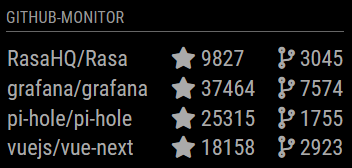

# MagicMirror² Module - GitHub Monitor
## What?
This module enables you to display certain information about your favourite GitHub Repositories on your MagicMirror² Mirror.



## How?
### Installation
  1. Navigate to the `/modules` folder of you MagicMirror²
  2. Clone this repository using the following command: `git clone https://github.com/fpfuetsch/MMM-GitHub-Monitor.git`
### Configuration
To use this module, add it to the modules array in the `config/config.js` file:
```javascript
modules: [
	{
		module: 'MMM-GitHub-Monitor',
		position: 'top_left', // any possible region
		config: {
			repositories: [ // list of GitHub repositories to monitor
				{
					owner: 'MichMich', // reposistory owner
					name: 'MagicMirror', // repository name
					pulls: {
						display: true, // show recent pull requests
						loadCount: 10, // cycle through 10 latest pull requests
						displayCount: 2, // show 2 pull requests at a time
						state: 'open', // show only open pull requests
						sort: 'created', // sort by creation date
						direction: 'desc', // sort in descending order
					}
				},
				{
					owner: 'fpfuetsch',
					name: 'MMM-GitHub-Monitor',
				},
			],
			sort: true, // sort repositories alphabetically (default: true)
			updateInterval: 10000, // update interval in milliseconds (default: 10 min)
			baseURL: 'https://YOUR_GITHUB_URL/api/v3', // Optional for non-public githubs
        },
	},
]
```
### Update
Navigate to the folder of the module in the `/modules` folder and get the latest version using the command `git pull`.
